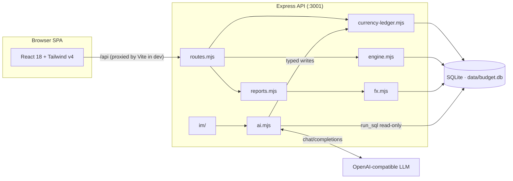

<div align="center">

# Xiaowen Budget · 小文预算

**A local-first, YNAB-style zero-based budgeting app with multi-currency ledgers and a built-in AI assistant**

[](https://github.com/iamshaynez/xiaowen-ynab/actions/workflows/ci.yml)
[](https://nodejs.org)
[](./LICENSE)

English | [简体中文](./README.md)

</div>

---

Xiaowen Budget runs entirely on your own machine. Your ledger, budgets, reports, and AI assistant live in a single SQLite file. One local database is one household shared budget.

It follows the four YNAB rules: give every dollar a job, embrace your true expenses, roll with the punches, and age your money. Each currency has its own budget ledger. Accounts in the same currency share one Ready to Assign pool. The same assistant can also connect to Telegram or a personal WeChat account so you can bookkeep from chat.

## Multi-currency

Built-in currencies are CNY, USD, SGD, CAD, EUR, GBP, and JPY. A new household enables CNY, USD, SGD, JPY, and EUR by default; you can turn on CAD or GBP later in Settings. Account amounts are stored in that currency's minor units. JPY has no fake two decimal places.

Same-currency transfers take one amount. Cross-currency exchanges require the bank's real outflow and inflow; a reference FX rate is only a comparison and never fills in the booked amounts for you.

The UI label is "reporting currency" (汇总币种). In accounting terms this is the presentation currency. Consolidated net worth converts balances at a valuation date for reporting only; it does not write back into native ledgers. The FX adapter is replaceable. The default source is Frankfurter v2 pinned to ECB reference rates. A manual rate on the same day wins. Native-currency bookkeeping works offline. When a rate is missing, unified totals are hidden and the missing pairs are listed.

Investment accounts are off-budget tracking accounts. The app currently records total value and net contributions. It does not track holdings, cost basis, or returns.

The first upgrade of an old database writes a local backup, then asks you to choose the old ledger's currency. JPY scaling is allowed only when every legacy amount is divisible by 100.

## Features

### Budgeting
- **Ready to Assign**: allocate every month's income across categories until it hits zero. Each currency has its own pool.
- Monthly assigning, moving money between categories, covering overspending, one-click "copy last month's budget"
- Category goals: save by target date or by target balance; auto-assign fills in what each category still needs
- Age of Money, overspent categories, and uncategorized-transaction alerts

### Accounts
- Checking / savings / cash / credit cards / lines of credit / investments / property / vehicles / student & personal loans and more
- New accounts pick a built-in currency; on-budget vs. tracking accounts; close accounts you no longer use
- Credit card spending automatically moves funds into the card's payment category; transfers to a card are payments

### Transactions
- Income / expense / transfer entry in one place; transfers are automatically paired double entries
- Foreign-currency purchases can keep the merchant original amount alongside the bank's booked amount; the budget uses the booked amount
- Bulk categorize, bulk delete, quick clear, reconcile
- Refunds go back to the original expense category — they reduce spending rather than counting as income

### Reports
- Native income and expense, by currency
- Consolidated net worth: current and historical assets, liabilities, and net worth in the reporting currency, with rate dates and sources
- Spending breakdown, top payees, income sources

### Investments
- Native-currency balance, net contributions, net withdrawals, and latest valuation date
- Reconcile to the broker's total value; valuation adjustments enter net worth and stay out of everyday income and expense

### AI Assistant
- Conversational bookkeeping and querying: "log lunch, ¥35" or "how much did we spend on dining out last month?"
- Works with any OpenAI-compatible Chat Completions endpoint; base URL, model name, and API key are configurable in Settings
- `run_sql` is read-only. Creating transactions, transfers, accounts, budget assignments, goals, and reconciles uses typed tools that share the web app's business interface
- With confirmation on, you first see a semantic summary of the change, not newly generated write SQL. With confirmation off, the same business checks still run; the write just happens immediately
- Persistent chat sessions; replies render Markdown and Mermaid charts

### IM Channels
- **Telegram bot**: long-polling integration — paste a bot token and go
- **Personal WeChat**: QR-code login over the ilink bot protocol; text messages only
- Multi-session management, write confirmations that survive restarts, resumable message cursors so no message is lost
- Approve or reject pending writes right from chat ("confirm" / "cancel"); `/new` starts a fresh session

### Daily Backup
- Automatic SQLite backup (online snapshot + gzip) at a fixed time every day, without locking the database
- Works with any S3-compatible object storage (e.g. **Cloudflare R2**) via built-in SigV4 signing — no extra dependencies
- Keeps the latest 7 versions locally under `data/backups/` and on the remote, older ones roll over
- Manual "back up now" and remote connection test; missed schedules are caught up automatically after restart

### Misc
- Optional password login (JWT issued; constant-time comparison to prevent timing side channels)
- English / Simplified Chinese UI; amounts format in the account currency
- One-click demo data covering a household CNY checking account, a CNY credit card, a USD investment account, an SGD checking account, JPY cash, and a zero-balance EUR reserve account

## Tech Stack

| Layer    | Technology                                                                              |
| -------- | --------------------------------------------------------------------------------------- |
| Frontend | React 18 · TypeScript (strict) · Vite 6 · Tailwind CSS v4 · Recharts · Mermaid          |
| Backend  | Node.js 20+ · Express 4 · better-sqlite3                                                |
| Data     | Single-file SQLite (WAL mode) · versioned migrations applied at startup                 |
| Testing  | Vitest (node environment for server, jsdom for React components)                        |
| CI       | GitHub Actions: typecheck + full test suite + production build                          |

## Architecture



Web, chat, and IM all write through the Currency Ledger. Budget math in the engine (`goalNeed`, `ageOfMoney`, …) stays pure so it unit-tests without a database.

## Getting Started

Prerequisite: Node.js 20+.

```bash
git clone https://github.com/iamshaynez/xiaowen-ynab.git
cd xiaowen-ynab
npm install
npm run dev
```

Open <http://localhost:5173> (the API runs on `:3001`; Vite proxies `/api` automatically). On first launch, click "Load demo data" to explore the app with sample numbers.

### Production build

```bash
npm run build
npm start
```

In production mode Express serves the built frontend as well — <http://localhost:3001> is the whole app.

### Docker

```bash
APP_PASSWORD=your-password docker compose up -d --build
```

The image is a multi-stage build; data persists in the named volume `budget-data` (switch `docker-compose.yml` to a `./data:/data` bind mount if you prefer). A health check (`/api/auth/status`) is built in.

## Configuration

### Environment variables

| Variable       | Default          | Description                                                          |
| -------------- | ---------------- | -------------------------------------------------------------------- |
| `PORT`         | `3001`           | Server listening port                                                 |
| `DATA_DIR`     | `./data`         | Directory holding the SQLite database                                 |
| `APP_PASSWORD` | (unset)          | When set, enables password login for the web UI                       |
| `JWT_SECRET`   | derived from pwd | JWT signing secret; set explicitly when running multiple instances    |

### AI model

Go to **Settings → AI** in the web UI and fill in any OpenAI-compatible base URL (e.g. `https://api.openai.com/v1`), model name, and API key, then hit "test connection".

### IM channels

Add channels under **Settings → IM Channels**:

- **Telegram**: create a bot via [@BotFather](https://t.me/BotFather) and paste its token;
- **Personal WeChat**: create a channel and scan the login QR code. The protocol supports text messages only; media is not supported yet.

Enabled channels are polled by the server; config changes take effect immediately without a restart.

## Data & Security

- All data lives in a single local SQLite file (default `./data/budget.db`). There is no telemetry. Native-currency bookkeeping does not need the network.
- With AI enabled, your ledger schema, account/category snapshot, and conversations are sent to whatever model endpoint you configure — choose providers you trust.
- `run_sql` is read-only: single statements only, `ATTACH`/`PRAGMA`/`VACUUM` rejected, internal tables (chat history, settings, IM channels, FX cache) hidden from the model. Financial writes must use typed tools that share the web app's checks.
- With write confirmation on, the assistant shows a semantic summary and waits. With it off, the same business validation still runs; the write just executes immediately.
- Automatic FX requests include only currency codes and dates, never account names, balances, or transactions.
- When `APP_PASSWORD` is set, every API endpoint except login requires a valid JWT (7-day expiry).
- The first multi-currency upgrade of an old ledger writes a reopenable backup first. If something looks wrong, restore that backup; do not try to downgrade the new schema.
- Back up the database file yourself — it *is* your ledger.

## Project Structure

```
.
├── src/                # React frontend (TypeScript)
│   ├── pages/          # Pages: Budget / Accounts / Reports / Transactions / Chat / Settings
│   ├── components/     # Reusable components (Sidebar, Modal, txEdit…)
│   ├── api.ts          # Typed client for /api
│   ├── store.tsx       # App-wide state
│   ├── i18n.ts         # English & Chinese strings
│   ├── money.ts        # Shared currency catalog and amount rules
│   └── format.ts       # Currency / date formatting
├── server/             # Express backend (ESM .mjs)
│   ├── index.mjs       # HTTP bootstrap
│   ├── routes.mjs      # REST /api routes
│   ├── engine.mjs      # Per-currency budget computation
│   ├── currency-ledger.mjs  # Transaction, transfer, and reconcile writes
│   ├── fx.mjs          # Rate cache, manual overrides, replaceable adapter
│   ├── reports.mjs     # Consolidated net worth
│   ├── investment.mjs  # Investment tracking view
│   ├── demo.mjs        # One-click demo data
│   ├── ai.mjs          # AI agent, read-only SQL, typed tools
│   ├── auth.mjs        # Password login / JWT
│   ├── migrations.mjs  # Versioned schema migrations
│   └── im/             # Telegram / personal WeChat adapters and session routing
├── shared/             # Currency catalog shared by frontend and backend
├── data/               # SQLite database files (not committed)
└── .github/workflows/  # CI (push / PR → dev: typecheck, test, build)
```

## Development

| Command                | What it does                                       |
| ---------------------- | -------------------------------------------------- |
| `npm run dev`          | Start API(:3001) and Vite(:5173) concurrently       |
| `npm run build`        | Type-check + build frontend                         |
| `npm test`             | Run the full test suite                             |
| `npm run test:watch`   | Run tests in watch mode                             |
| `npm run typecheck`    | `tsc -b --noEmit`                                   |

This project follows TDD: write the failing test first, then make it pass. New server-side logic requires a colocated `*.test.mjs`, and React components should have `*.test.tsx` coverage of their core behavior. PRs into `dev` must pass typecheck, the full test suite, and the production build.

## Contributing

Issues and PRs are welcome:

1. Fork, then branch off `dev`;
2. Make sure `npm run typecheck`, `npm test`, and `npm run build` pass (CI must be green for PRs targeting `dev`);
3. Use conventional-ish commit messages (`feat:` / `fix:` / `chore:`).

## License

[MIT](./LICENSE) © [Xiaowen Zhang](https://github.com/iamshaynez)
