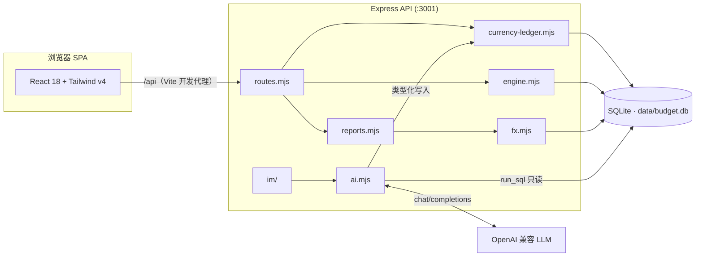

<div align="center">

# 小文预算 · Xiaowen Budget

**本地优先的 YNAB 式零基预算，支持多币种账本和 AI 记账助手**

[](https://github.com/iamshaynez/xiaowen-ynab/actions/workflows/ci.yml)
[](https://nodejs.org)
[](./LICENSE)

[English](./README.en.md) | 简体中文

</div>

---

小文预算跑在你自己的电脑上。账本、预算、报表和 AI 助手都落在同一个 SQLite 文件里，一份本地数据库就是一个家庭的共享预算空间。

它沿用 YNAB 四法则：给每一块钱一个任务，拥抱真实开支，灵活应变，关注资金账龄。每种币种有一份独立预算账本；同一币种的账户共用一份待分配金额（Ready to Assign）。你也可以把同一个助手接到 Telegram 或个人微信，在聊天里记账。

## 多币种

内置币种是 CNY、USD、SGD、CAD、EUR、GBP、JPY。新家庭默认启用 CNY、USD、SGD、JPY、EUR；CAD 和 GBP 可以在设置里再打开。账户金额按该币种的最小单位保存，日元没有伪造的两位小数。

同币种转账只填一端金额。跨币种换汇必须填银行真实的转出额和到账额，参考汇率只用来对照，不会替你填入账金额。

界面上的「汇总币种」对应会计里的列报货币。统一净资产按估值日把各币种余额换算到汇总币种，只做报表，不会改写原币账本。汇率来源可以替换，默认用 Frankfurter v2 并固定欧洲央行（ECB）参考汇率；同一天如果有人工汇率，人工值优先。原币记账和预算不需要网络；缺汇率时，统一总数会隐藏，并列出缺了哪些币种对。

投资账户是预算外的跟踪账户，目前只记录总价值和净投入，不管理持仓、成本和收益率。

旧数据库第一次升级会先在本机备份，再让你选择旧账本的币种。只有全部旧金额都能被 100 整除时，才允许按日元缩放。

## 功能特性

### 预算
- **待分配金额（Ready to Assign）**：收入进账后逐月分配到分类，直到归零。每个币种各自一份。
- 按月分配、移动资金、弥补超支、一键复制上月预算
- 分类目标：按目标日期储蓄 / 按余额目标储蓄，「一键分配至目标」自动补齐差额
- 资金账龄（Age of Money）、超支与未分类交易提醒

### 账户
- 支票 / 储蓄 / 现金 / 信用卡 / 信用额度 / 投资 / 房产 / 车辆 / 各类贷款等资产与负债类型
- 新建账户时选择内置币种；预算内 / 预算外账户，支持关闭账户
- 信用卡消费自动从还款科目划扣额度，向信用卡转账即为还款

### 交易
- 收入 / 支出 / 转账三合一录入；转账双分录自动配对
- 外币消费可以同时记下商户原始金额和银行入账金额，预算只看入账金额
- 批量分类、批量删除、快速清算、对账（reconcile）
- 退款记回原支出分类，用来抵掉这笔支出

### 报表
- 原币收支：收入、支出、分类构成按币种分开看
- 统一净资产：按汇总币种查看当前和历史的资产、负债与净资产，并标明汇率日期和来源
- 支出构成、Top 商家、收入来源

### 投资
- 按原币查看投资账户余额、净投入、净取回和最近估值日期
- 通过对账把账户调到券商显示的总价值；估值调整进入净资产，不进入日常收支

### AI 助手
- 对话式记账与查账，例如「记一笔午饭 35 元」「上个月餐饮花了多少」
- 兼容任意 OpenAI Chat Completions 接口，Base URL / 模型名 / 密钥都在设置页配置
- `run_sql` 只读。创建交易、转账、账户、预算、目标和对账走类型化工具，和网页同一套业务规则
- 确认开关打开时，先显示这次改动的摘要，不会把新的写 SQL 亮给你看；关掉确认后仍会做业务校验，只是不再问第二遍
- 会话历史持久化；回复支持 Markdown 与 Mermaid 图表

### IM 渠道
- **Telegram Bot**：长轮询接入，配置 Bot Token 即用
- **个人微信**：扫码登录（ilink bot 协议），收发文字消息
- 多会话管理、待确认写操作跨重启持久化、消息游标断点续拉不丢消息
- 在聊天里回复「确认 / 取消」即可审批写操作，`/new` 开启新会话

### 每日备份
- 每天定点自动备份 SQLite 数据库（在线快照 + gzip），不锁库不影响使用
- 远端可接入任意 S3 兼容对象存储（如 **Cloudflare R2**），内置 SigV4 签名直传，无需额外依赖
- 本地 `data/backups/` 与远端各保留最近 7 个版本，旧的滚动删除
- 支持手动「立即备份」与远端连通性测试；错过时刻（宕机等）重启后自动补跑

### 其他
- 可选密码登录（JWT 签发，恒定时间比较防时序侧信道）
- 中英双语界面，按账户币种格式化金额
- 一键载入示例数据，覆盖家庭人民币日常账户、信用卡、美元投资、新加坡元日常账户、日元现金和欧元零余额备用账户

## 技术栈

| 层      | 技术                                                             |
| ------- | ---------------------------------------------------------------- |
| 前端    | React 18 · TypeScript (strict) · Vite 6 · Tailwind CSS v4 · Recharts · Mermaid |
| 后端    | Node.js 20+ · Express 4 · better-sqlite3                         |
| 数据    | SQLite 单文件（WAL 模式）· 版本化迁移，启动即建表                |
| 测试    | Vitest（服务端 node 环境 + 组件 jsdom 环境）                     |
| CI      | GitHub Actions：typecheck + 全量测试 + production build          |

## 架构



网页、聊天和 IM 的财务写入都经过 Currency Ledger。预算计算（`goalNeed`、`ageOfMoney` 等）保持纯函数，可脱离数据库单测。

## 快速开始

环境要求：Node.js 20+。

```bash
git clone https://github.com/iamshaynez/xiaowen-ynab.git
cd xiaowen-ynab
npm install
npm run dev
```

打开 <http://localhost:5173>（API 跑在 `:3001`，Vite 自动代理 `/api`）。首次进入空账本时，可以点击「载入示例数据体验」快速上手。

### 生产构建

```bash
npm run build
npm start
```

生产模式下 Express 同时托管前端静态资源，访问 <http://localhost:3001> 即是完整应用。

### Docker 部署

```bash
APP_PASSWORD=your-password docker compose up -d --build
```

镜像为多阶段构建，数据通过命名卷 `budget-data` 持久化（也可在 `docker-compose.yml` 中改为 `./data:/data` 绑定挂载）。容器自带健康检查（`/api/auth/status`）。

## 配置

### 环境变量

| 变量          | 默认值     | 说明                                   |
| ------------- | ---------- | -------------------------------------- |
| `PORT`        | `3001`     | 服务监听端口                           |
| `DATA_DIR`    | `./data`   | SQLite 数据库目录                      |
| `APP_PASSWORD`| （未设置） | 设置后启用网页密码登录                 |
| `JWT_SECRET`  | 由密码派生 | JWT 签名密钥，多实例部署时建议显式指定 |

### AI 模型

进入网页端 **系统设置 → AI 配置**，填写任意 OpenAI 兼容服务的接口地址（如 `https://api.openai.com/v1`）、模型名与 API Key，点击测试连接即可。

### IM 渠道

在 **系统设置 → IM 渠道** 中添加：

- **Telegram**：向 [@BotFather](https://t.me/BotFather) 申请 Bot Token 后填入；
- **个人微信**：创建渠道后扫码登录。协议仅支持文字消息，媒体收发暂不支持。

渠道启用后长轮询由服务端托管，修改配置即时生效，无需重启。

## 数据与安全

- 所有数据保存在本机单个 SQLite 文件中（默认 `./data/budget.db`），没有遥测，原币记账也不依赖云端。
- 启用 AI 功能后，账本 Schema、账户/分类快照及对话内容会发送给你自行配置的模型服务端点；请选择你信任的服务商。
- AI 的 `run_sql` 只允许只读查询：单条语句，禁止 `ATTACH`/`PRAGMA`/`VACUUM`，聊天记录、设置、IM 渠道、汇率缓存等内部表对模型不可见。财务写入必须走类型化工具，和网页共用校验。
- 打开「写操作需二次确认」时，助手先给出语义摘要，等你确认后再改库；关掉后仍经过业务校验，只是立即执行。
- 自动汇率请求只带币种代码和日期，不发送账户名称、余额或流水。
- 设置 `APP_PASSWORD` 后，除登录接口外的全部 API 均要求有效的 JWT（7 天有效期）。
- 第一次把旧账本升到多币种时，系统会先写一份可重新打开的备份。出了问题就恢复这份备份，不要指望把新 Schema 直接降回去。
- 数据库文件请自行纳入备份策略，它就是你的全部账本。

## 项目结构

```
.
├── src/                # React 前端（TypeScript）
│   ├── pages/          # 页面：Budget / Accounts / Reports / Transactions / Chat / Settings
│   ├── components/     # 复用组件（Sidebar、Modal、txEdit…）
│   ├── api.ts          # /api 的类型化客户端
│   ├── store.tsx       # 应用级状态
│   ├── i18n.ts         # 中英文案
│   ├── money.ts        # 与后端共用的币种目录和金额规则
│   └── format.ts       # 货币 / 日期格式化
├── server/             # Express 后端（ESM .mjs）
│   ├── index.mjs       # HTTP 启动入口
│   ├── routes.mjs      # REST /api 路由
│   ├── engine.mjs      # 分币种预算计算
│   ├── currency-ledger.mjs  # 交易、转账、对账写入
│   ├── fx.mjs          # 汇率缓存、人工覆盖、可替换 Adapter
│   ├── reports.mjs     # 统一净资产
│   ├── investment.mjs  # 投资跟踪账户视图
│   ├── demo.mjs        # 一键演示数据
│   ├── ai.mjs          # AI Agent、只读 SQL 与类型化工具
│   ├── auth.mjs        # 密码登录 / JWT
│   ├── migrations.mjs  # 版本化 Schema 迁移
│   └── im/             # Telegram / 个人微信渠道适配与会话路由
├── shared/             # 前后端共用的币种目录
├── data/               # SQLite 数据库文件（不入库）
└── .github/workflows/  # CI（push / PR → dev：typecheck、test、build）
```

## 开发

| 命令                    | 说明                            |
| ----------------------- | ------------------------------- |
| `npm run dev`           | 并行启动 API(:3001) 与 Vite(:5173) |
| `npm run build`         | 类型检查 + 前端构建             |
| `npm test`              | 运行全量测试                    |
| `npm run test:watch`    | 监视模式跑测试                  |
| `npm run typecheck`     | `tsc -b --noEmit`               |

本项目采用 TDD 工作流：先写失败测试，再写实现。服务端新逻辑必须带有同目录的 `*.test.mjs`，React 组件应有 `*.test.tsx` 覆盖核心行为。合入 `dev` 的 PR 必须通过 typecheck、全量测试和生产构建。

## 参与贡献

欢迎 Issue 与 PR：

1. Fork 并从 `dev` 切出分支；
2. 保证 `npm run typecheck`、`npm test` 与 `npm run build` 通过（CI 对 `dev` 的 PR 强制绿检）；
3. 提交信息遵循 `feat:` / `fix:` / `chore:` 约定式前缀。

## License

[MIT](./LICENSE) © [Xiaowen Zhang](https://github.com/iamshaynez)
